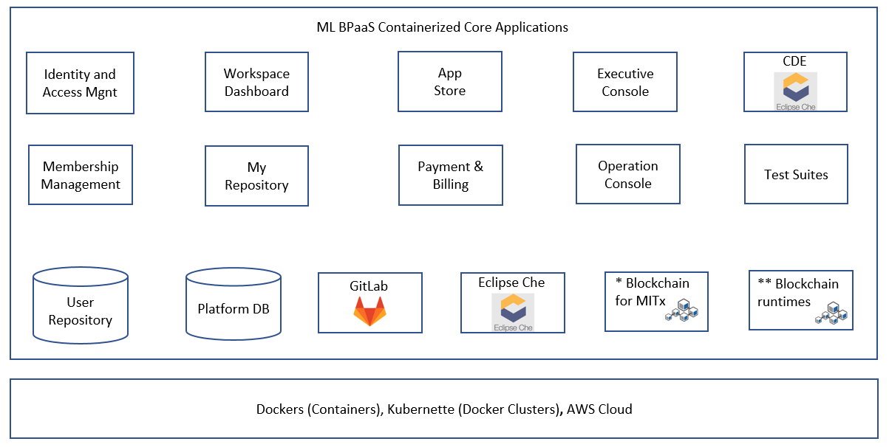
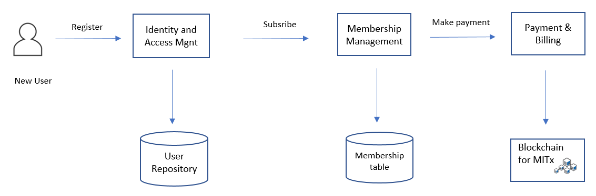
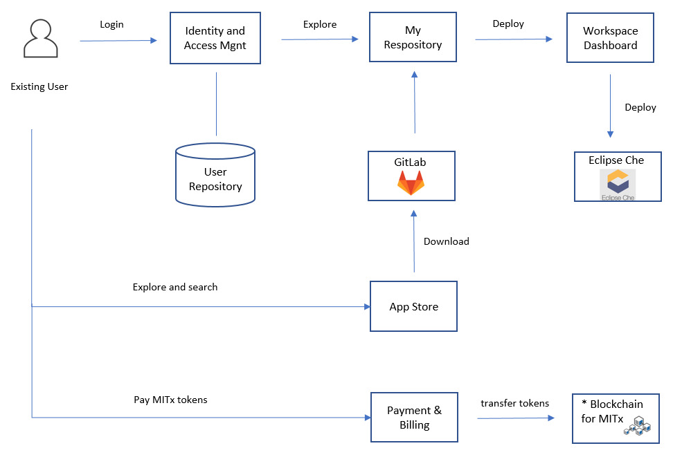

# Morpheus Labs

# MORPHEUS BLOCKCHAIN PLATFORM AS A SERVICE (BPaaS)
This repo provides a technical overview about Morphues Labs BPaaS platform.
## Disclaimer
Our aim is to provide high transparency about our platform development and have sufficient information available to public in order for them to use our platform:
 - Sample applications for different blockchain technologies that are to be deployed in our platform
 - Technology stack recipes that we use in order to automate the blockchain deveopment and test
 - Language Services agents to facilitate smart contract development in our CDE
 - Other open source components are dedicated to facilitate the user interaction/integration with our platform core components

 However, for the core modules of our proprietary code will be maintained in private repositories.

# Description
Our project aims to create a Blockchain Platform As A  Service that simplifies and expedites blockchain application development and test.
Our current goal is to give project teams the flexibility to easyly choose between different programming languages and blockchain runtimes that better suit user needs and quickly create end-to-end solutions for faster Blockchain application development.

 The image above shows the high level technical architecture. The technologies shown are only exemplificative as the final choice may vary in time.

 The image above is the high level application architecture showing the Key components of the ML BPaaS.

##  CDE
  - Cloud IDE. Our IDE is a custom implementation of the open source Eclipse Che (https://www.eclipse.org/che/), one of the most powerful cloud IDE for collaborative development. We are also adding remote project development capabilities (via SSH/WebHTTPs) to make use local IDEs like VSCode (https://github.com/Microsoft/vscode) and Atom via Nuclide (https://github.com/facebook/nuclide) to connect to our CDE.
  - For Blockchain Developers, we provide dedicated Workspaces Orchestration for Organisations/Teams/Subteams
  - Git capabilities for teams repositories and version control
  - Blockchain runtimes with local blockchain runtime, e.g. Ganache or Truffle within thw workspace, single node network or multiple nodes network
  - A list of preconfigured blockchain development stacks for various development needs. All new stack recipes , aside the existing predefined by our team, will be published in https://github.com/Morpheuslabs-io/BaaS-recipes. A stack recipe is like a composer file that compose up the entire technology stack necessary for application development, test and deploy.
  - Developers shall be able to select any supported blockchain and develop it in a selected language they are competent in. For this purpose, our CDE provides a plenty of language services choice (eg. Go, Python, Java, Solidity, C++, .Net ...). Our effort to add more languages in our cloud CDE started here https://github.com/Morpheuslabs-io/morpheus-cde

  For more information about Morpheus Labs BPaaS CDE https://github.com/Morpheuslabs-io/morpheus-cde

##  App Store (App Library)
Application store is a crowdsourced marketplace to curate all blockchain-based applications. It allows seekers to browse for ideas that suit their businesses and purchase ready-to-use or customised products; it also allows contributors to promote their applications.

  For more information about App Store https://github.com/Morpheuslabs-io/morpheus-app-store

## Blockchain Sample Application
### Ethereum based sample applications
  This repo is dedicated to our collection of samples DApps and smart contract related apps. These application may have been modified from the original samples applications available in other repositories, to be used in Morpheus Labs BPaaS. The sample applications can be used as Tutorial or a starting point for further prototyping.
  https://github.com/Morpheuslabs-io/ethereum-sample-apps
  
### Other sample applications

Various blockchain offcain and onchain applications will be available in the AppLibrary of our platform.

## Blockchain Operation Console
The Operations console aggregates the operational activities required to monitor and manage the Blockchain network provisioned on the platform. The Blockchain network managed by Blockchain Operation Console are Ethereum, HyperLedger Fabric, NEM (https://nemlibrary.com/) and Multichain. More blockcahin networks will be added in future. Details about "Blockchain Operation Console" https://github.com/Morpheuslabs-io/morpheus-ops-console.

## Membership Management

This module manages platform service subscription for all the users. The following diagram shows the high level flow.

## My Repository

My Repository module manages source codes that a platform user / team created or download from App Sore.

