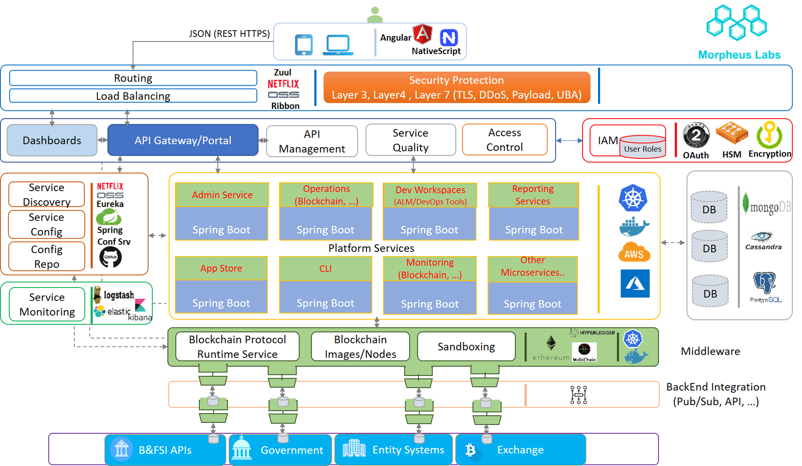

# Morpheus Labs

# MORPHEUS BLOCKCHAIN PLATFORM AS SERVICE BPaaS

# Description
Our project aims to create a Blockchain Platform As Service that simplifies and expedites blockchain application development.
Our first goal is to give to project teams the flexibility to easy choose between different programming languages and blockchain runtimes that better suit your needs. To achieve the goal we are creating end-to-end solution for faster development in Blockchain.

The image above shows the high level architecture. The technologies shown are only exemplificative as the final choice may vary in time.
#  CDE
  - Cloud IDE. Our IDE is a custom implementation of the opensource Eclipse Che (https://www.eclipse.org/che/), one of the most powerful cloud IDE for collaborative development. We are working to create remote project development (via SSH/WebHTTPs) for local IDEs like VSCode (https://github.com/Microsoft/vscode) and Atom via Nuclide (https://github.com/facebook/nuclide) to connect to our CDE.
  - For Blockchain Developers we provide dedicated Workspaces Orchestration for Organisations/Teams/Subteams
  - Git capabilities for teams repositories and Version Control
  - Blockchain runtimes as single (eg. only dev machine) or multiple machines(eg. Dev Machine, Test, Live Nodes, Other..)
  - A list of preconfigured blockchain development stacks for various development needs. All new stack recipes , aside the existing predefined by our team, will be published in https://github.com/Morpheuslabs-io/BaaS-recipes. A stack recipe is like a composer file that compose up the entire technology stack necessary for code, teste nd deploy.
  - Developers shall be able to select any blockchain and develop it in any language they are competent in. For this purpose using our CDE we aim to give a plenty of language services choice (eg. Go, Python, Java, Solidity, C++, .Net ...). Our effort to add more languages in our cloud CDE started here https://github.com/Morpheuslabs-io/morpheus-cde

  For more information about Morpheus BPaaS CDE https://github.com/Morpheuslabs-io/morpheus-cde

#  App Store (App Library)
Application store is a crowdsourced marketplace to curate all blockchain-based applications. It allows seekers to browse for ideas that suit their businesses and purchase ready-to-use or customised products; it also allows contributors to promote their applications.

  For more information about App Store https://github.com/Morpheuslabs-io/morpheus-app-store

# Blockchain Operation Console
